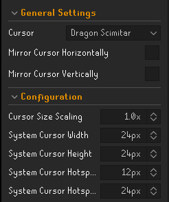

# Linux Custom Cursor
Java has an issue where all cursors are restricted to 2 colors at most. Any cursors are flattened to 2 colors making 
them appear flat and ugly. This plugin circumvents that by displaying an image at the location of the cursor while 
making the cursor transparent. It technically works on all platforms, but other platforms probably don't need it.

There will be a small delay between the image rendering and the actual "cursor" movement. 
This delay is pretty unnoticeable in my testing, however.

### Extra Cursors
A number of additional pre-made cursors are also included and the custom cursor/equipped weapon features 
from the original are also implemented.

* 24-Carat Sword
* Armadyl Godsword
* Cursed Banana
* Dragon Defender
* Dragon Halberd
* Hunting Knife
* Lobster
* Red Chinchompa
* Rubber Chicken
* Salmon
* Stale Baguette
* Tecu Salamander

### Cursor Calibration
Cursors are generally a square image such as 24x24 with the "click spot" offset by around 10px/5px 
in the horizontal/vertical directions respectively. Unfortunately, it's not really possible (as far as I know) to get 
this information dynamically from Java, so the user will have to edit it themselves.

* System Cursor Width/Height: Get this from your system settings. It is almost 100% certainly a square shape. If you are uncertain, just increase/decrease them simultaneously until the click spot matches.
* Cursor Hotspot X Offset: how far to the right from the top-left of the image should the click spot be. This number is usually around 10 pixels on a 24x24 cursor.
* Cursor Hotspot Y Offset: how far down from the top-left of the image the click spot should be. This number is usually around 5 pixels on a 24x24 cursor.

### Debug Settings
* As of now, just one option to also render the normal system cursor at the same time. This can be useful to help adjust the hotspot.